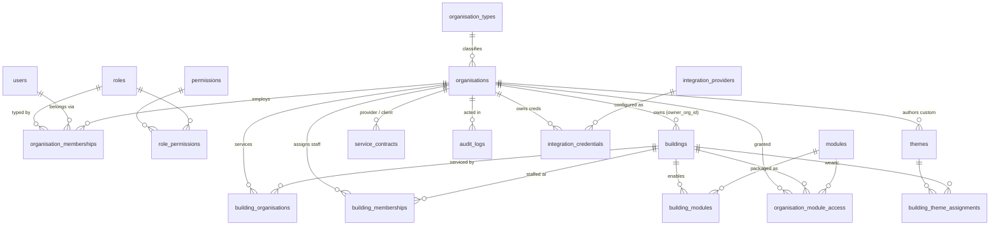

# ARCHITECTURE — data model & authorisation

## ERD (core platform tables)

Service Desk tables (`sd_*`, migration 0002) hang off `buildings` +
`organisations` and follow the same pattern; see 0002 for their ERD slice.

## How a permission check flows

Every core policy asks ONE question — `app.can(user, org, building, module,
action)` (migration 0004). Each argument is optional; a null skips that
clause. The function is SECURITY DEFINER, so it can read the membership
tables regardless of the caller's row visibility, and it FAILS CLOSED:
no user → false.

Walkthrough — *the concierge's app asks for cleaning timesheets*:

1. The request arrives with the concierge's JWT; Postgres RLS evaluates the
   timesheet table's policy, which calls
   `app.can(auth.uid(), FOCT_org, aurora, 'cleaning_ops', 'read')`.
2. **Super-admin clause** — is the caller a `super_admin` anywhere? No.
3. **Org clause** — is the concierge an active member of *FOCT Cleaning*?
   No → the whole AND-chain is false. `can()` returns **false**, the policy
   filters every row, the concierge sees an empty set. Postgres itself —
   not the UI — enforced the isolation rule.
4. Had the caller been the FOCT cleaning manager: org clause passes
   (active membership), building clause passes (FOCT actively services
   Aurora via `building_organisations`), module clause passes
   (`building_modules` has cleaning_ops **enabled** at Aurora AND FOCT holds
   an `organisation_module_access` grant), action clause passes (`read` needs
   any active role) → **true**, rows flow.

Action vocabulary: `read` (any active member) · `manage` (org_admin or
manager — also "manages the building" when checked against a building's
owner org) · `admin` (org_admin only). Cross-org sharing is NEVER implicit:
it exists only as explicit rows in `building_organisations`,
`organisation_module_access` or `service_contracts`.

The client mirrors this through `src/lib/authz.ts` → `public.can` RPC
(self-queries only; the database remains the sole authority; fails closed).
sd_* policies (0002/0003) compose the same underlying helpers
(`app.can_access_building`, org membership) — identical model, kept on the
proven expressions per the 2026-07-12 owner decision.

## Verification

`supabase/tests/isolation_check.sql` (23 assertions) +
`tests/sd_isolation_check.sql` (15) run as plain SQL in the Supabase editor
or against the local PG16 mirror (`tests/local_prelude.sql` shims auth.*).
The 0004 reroute was proven by double-running APPLY_STAGE2 on a fresh
database and passing both suites before AND after — outputs recorded in the
2026-07-12 session log.
